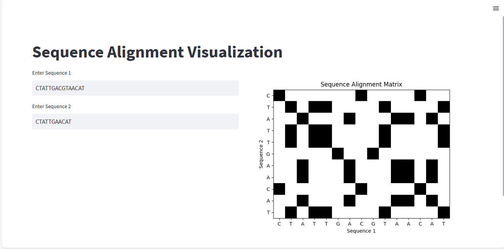

# DNA-Dot-Plot-Sequence-Comparison

This is a simple tool for visualizing sequence alignments using dot plots. 

- [Usage](#Usage)
- [How to Run](#How-to-Run)
- [Dependencies](#Dependencies)
- [Code Overview](#Code-Overview)
- [File Structure](#File-Structure)
- [Screenshots](#screenshots)
  
## Usage

1. Enter the sequences you want to align in the designated input fields.
2. The tool will generate a dot plot visualization of the alignment matrix.

## How to Run

1. Ensure you have Python installed on your system.
2. Install the required libraries using `pip install -r requirements.txt`.
3. Run the `app.py` file using `streamlit run app.py`.
4. Access the application in your web browser.

## Dependencies

- [Streamlit](https://streamlit.io/)
- [Biopython](https://biopython.org/)
- [NumPy](https://numpy.org/)
- [Matplotlib](https://matplotlib.org/)

## File Structure

- `app.py`: Main application script for running the sequence alignment visualization tool.
- `Dot_Plot_Functions.py`: Python script containing functions for computing alignment matrices and drawing dot plots.

## Code Overview

The main functionality is provided by the following files:

- `app.py`: Imports the necessary libraries, defines the Streamlit interface, and calls functions from `Dot_Plot_Functions.py` to compute and display the alignment matrix.
- `Dot_Plot_Functions.py`: Contains functions for computing alignment matrices and drawing dot plot visualizations.

## Screenshots

